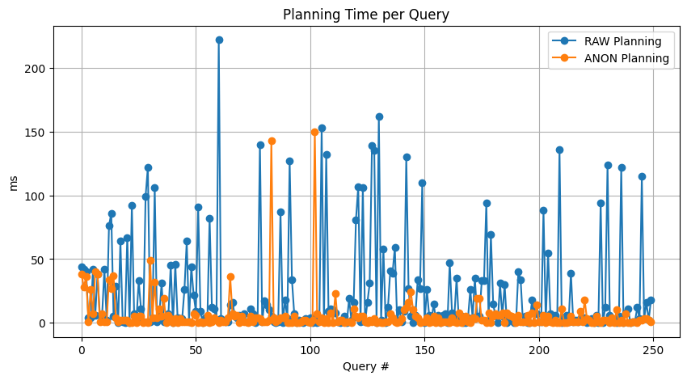
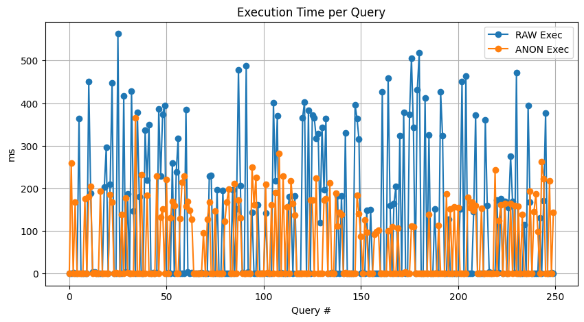

# **Query Workload Performance Analysis with Neo4j**

This project was developed to demonstrate my understanding of **Neo4j Fundamentals** and **Cypher Fundamentals**, as well as to analyze how query variations affect planning and execution performance in Neo4j.

---

## 🎓 **Completed GraphAcademy Courses**

- **Cypher Fundamentals**  
  https://graphacademy.neo4j.com/c/65a52e8d-e666-4cf6-9fa7-b0b79a6f3afb/

- **Neo4j Fundamentals**  
  https://graphacademy.neo4j.com/c/77c73c9d-8265-4564-9781-813d52a6bf5f/

---

## 📦 **Dataset**

This project uses the *recommendation dataset* from Neo4j Graph Examples:

📂 https://github.com/neo4j-graph-examples/recommendations/blob/main/data/recommendations-5.26-block.dump

Imported locally into **Neo4j Desktop 2.0.5** using **Cypher 5.25**.

---

## 📁 **Repository Structure**

```
├── workload.py             # Main workload executor
├── anonymizer.py           # Query normalization implementation
├── analysis.ipynb          # Log parser and performance analysis
├── .gitattributes          
├── logs/
│   ├── raw/                # Logs for original queries
│   └── anon/               # Logs for anonymized queries
├── images/                 # Visualizations included in the README
└── README.md
```

---

## 🧪 **Workload Generation**

The workload intentionally introduces variations in query structure to observe how they affect plan reuse in Neo4j.

### **🔹 Variation Types**
| Variation | Meaning | Purpose |
|----------|---------|---------|
| `actor{i}:Actor` | Unique variable names | Breaks plan reuse |
| Formatting changes | Extra spaces / layout | Breaks structural matching |
| `title:"Movie{i}"` | Different literal values | Forces new ASTs |
| Swapped property order | `{year:..., title:...}` → `{title:..., year:...}` | Prevents plan caching |
| Varying `LIMIT` | Changes row count | Prevents reuse |
| Aliases (`AS actorNameX`) | Unique identifiers | Makes queries “new” |

---

## 🔍 **Performance Data Collected (via `PROFILE`)**

Key metrics extracted from the profiling summary:

```python
args = summary.profile["args"]
planning_ms = summary.result_available_after
execution_ms = summary.result_consumed_after
global_memory = summary.profile["args"].get("GlobalMemory")
pure_execution_ms = max(0, execution_ms - planning_ms)
rows = args.get("Rows", "?")
db_hits = args.get("DbHits", "?")
```

### **🔹 Why These Metrics Matter**
| Metric | Why It Matters |
|--------|----------------|
| **Planning Time** | Measures planner overhead and plan cache misses. |
| **Execution Time** | Total runtime for the query. |
| **Pure Execution Time** | Time spent executing operators, excluding planning. |
| **DB Hits** | Ensures queries perform comparable workload. |
| **Memory Usage** | Shows planner memory stability. |

---

## 🔄 **Query Anonymization**

Queries are anonymized to remove structural differences:

- Variable names replaced  
- Literals normalized  
- Property ordering fixed  
- Aliases standardized  

Logs for both modes are stored separately:

```
logs/raw/   → Raw workload logs  
logs/anon/  → Anonymized workload logs
```

### **Run workloads:**

```bash
# Run anonymized workload
python workload.py --mode anon

# Run raw workload
python workload.py --mode raw
```

### **Requirements:**

- A local Neo4j database running  
- Dataset imported  
- `.env` file including correct:
  - URI  
  - Username  
  - Password  

---

## 📈 **Results & Findings**

### **Final Performance Table**
| type | planning_ms | execution_ms | pure_execution_ms | memory |
|------|-------------|--------------|-------------------|--------|
| **anon** | 5.756 | 67.260 | 66.528 | 321.6 |
| **raw**  | 22.932 | 116.436 | 100.304 | 321.6 |

**Average Planning Improvement:** **17.18 ms**  


---

## 📊 Visual Comparison

### **Planning Time Comparison**



The planning-time plot shows a clear distinction between raw and anonymized queries:

- **Raw queries** exhibit large and inconsistent planning spikes, often exceeding **200 ms**, because each syntactically different query forces Neo4j to generate a new execution plan.  
- **Anonymized queries** remain consistently low (mostly **< 30 ms**) because variable names, literals, and property order are normalized, allowing Neo4j to **reuse cached execution plans**.

This demonstrates that anonymization significantly reduces planner overhead and results in more predictable, cache-friendly performance.

---

### **Execution Time Comparison**



Execution times further highlight the impact of anonymization:

- **Raw queries** show high variance, with frequent spikes above **400–500 ms**, caused by repeated full planning and execution for each unique query structure.
- **Anonymized queries** cluster much lower, typically between **80–200 ms**, with far fewer extreme outliers.

By restoring structural consistency across queries, anonymization enables Neo4j to reuse previously compiled plans, resulting in **lower average execution time** and far **more stable performance** across the workload.

---

---

## ✅ **Conclusion**

This project attempts to simulate workload generation and optimization to explore how performance can be improved by enabling Neo4j to skip repeated parts of the compilation process. Using a simplified workload, I examined how Neo4j handles planning, execution, and plan reuse. Through this exercise, I observed that even small syntactic differences can force the planner to build new execution plans, while anonymization restores structural similarity and leads to significant performance improvements.

Although this workload does not represent real enterprise-scale query generation, it has helped me build a strong intuitive understanding of how Neo4j’s planner behaves under variation-heavy workloads. I am fully open to feedback, corrections, and discussion—especially on real-world workload design, benchmarking methodologies, and recommended environments/tools for more accurate simulations—as I am eager to continue learning. 
---
